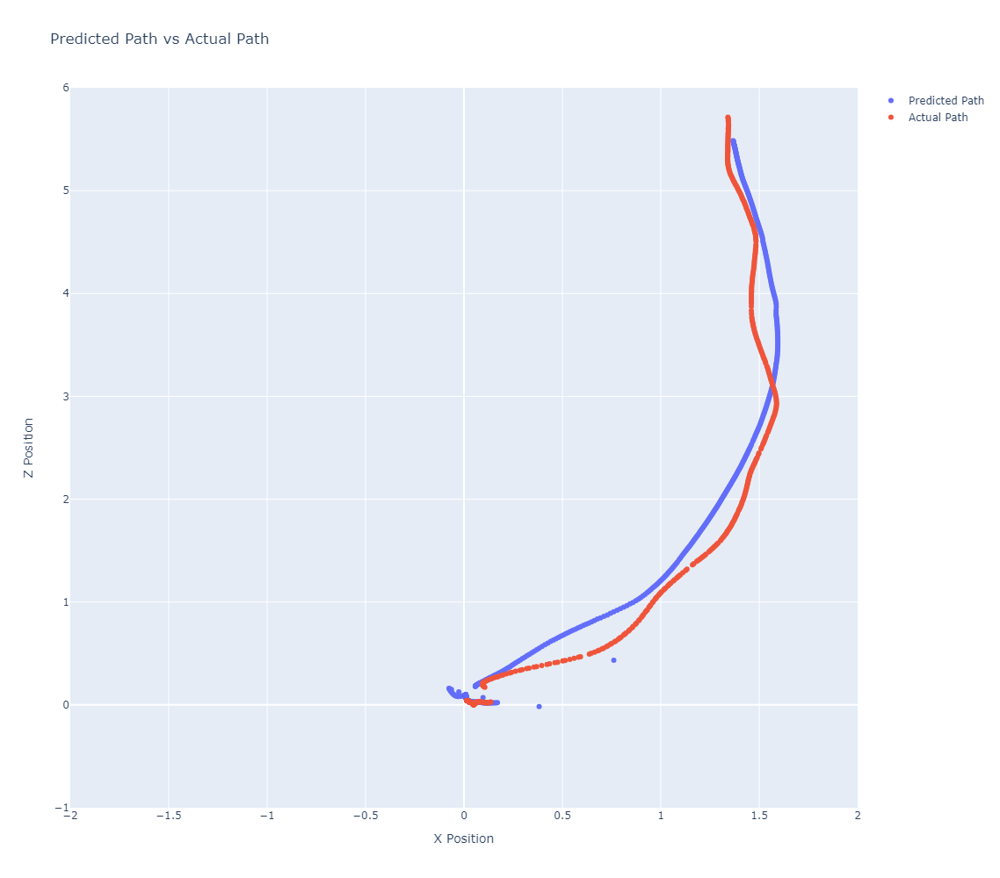

# LSTM-Path-Predictor

# Social Wayfinding Path Prediction with LSTM

This project is an AI model designed to predict human movement through crowded environments using LSTM (Long Short-Term Memory) networks. The model is based on data from an experiment conducted in a virtual reality (VR) train station populated with virtual agents simulating human crowds. Participants' task was to navigate around these virtual agents to reach a designated gate, reflecting real-world dynamics of "social wayfinding."

The ultimate goal of this project is to contribute to the development of robotics and AI systems capable of navigating around people in a natural, human-like manner.

## Prediction Examples

Below is an example plot showing the model's predictions compared to real participant paths.




*(Images are located in the `Predicted-vs-Actual-Path/` directory.)*


## Table of Contents
1. [Background](#background)
2. [Objective](#objective)
3. [Dataset](#dataset)
4. [Model](#model)
5. [Implementation](#implementation)
6. [Installation](#installation)
7. [Usage](#usage)
8. [Future Work](#future-work)

## Background
"Social wayfinding" refers to how people navigate around others in crowded spaces, taking into account the presence and motion of others to reach a goal. This project explores how humans navigate in a crowd, with potential applications in robotics and autonomous systems where robots need to interact smoothly with humans.

## Objective
The primary objective of this project is to train a model capable of predicting the next position of a person navigating a virtual crowded environment. By understanding how people avoid obstacles (in this case, other virtual agents) and optimize their paths, the model can be used to design more intuitive robotic and AI systems for crowded spaces.

## Dataset
The dataset used for this project consists of trajectory data from an experiment where participants moved through a VR train station towards a specific gate while avoiding virtual agents. Key features extracted include:

- **Distance from Objects**: Distance from virtual agents and obstacles at each time step.
- **Target Gate**: Position of the participant’s assigned gate.
- **Movement History**: Sequential data of past positions to help the LSTM model learn temporal patterns.

Each data point consists of a participant's position and orientation in the VR environment at each time step.

## Model
The model used is an LSTM neural network, chosen for its ability to learn temporal dependencies and predict sequential data. LSTM layers are particularly effective for this application as they can process time-series data where the prediction of the next point depends on the previous points in the sequence.

### Model Architecture
- **Input Layer**: Accepts features such as distance from obstacles and movement history.
- **LSTM Layers**: Capture the sequence of movements and predict the next position based on previous steps.
- **Dense Layers**: Used for final prediction, outputting the predicted position coordinates.
  
The LSTM model is trained to minimize the difference between predicted and actual paths, learning the patterns in participants’ navigation behavior.

## Implementation
The code is implemented in Python using TensorFlow and Keras for model building and training. The project follows standard machine learning workflows, including data preprocessing, model training, and evaluation.

### Requirements
- Python 3.7+
- TensorFlow
- Keras
- NumPy
- Pandas
- Plotly (for visualization)

## Installation
1. **Clone this repository**:
   ```bash
   git clone https://github.com/VashishtBorkar/LSTM-Path-Predictor.git
   ```
2. **Navigate to the project directory**:
   ```bash
   cd Path\ Predictor
   ```
3. **Install dependencies**:
   Create a virtual environment (recommended) and install dependencies from `requirements.txt`:
     ```bash
     python3 -m venv venv
     source venv/bin/activate  # For Linux/Mac
     venv\Scripts\activate     # For Windows
     pip install -r requirements.txt
     ```

## Usage
### 1. Data Processing
To load and preprocess the data, use functions from `data_processing.py`. The example below demonstrates loading a dataset and preprocessing it:

```python
from data_processing import load_data, preprocess_data, create_list_of_sequences, create_training_split

data = load_data('path/to/data.csv')

# Raw data in a multidimensional array [participant, trial, frames, features]
processed_data = preprocess_data(data)

# List of sequences for use by LSTM
feature_sequences, label_sequences = create_list_of_sequences(processed_data)
x_train, x_test, y_train, y_test = create_training_split(feature_sequences, label_sequences, test_size=0.2)

```

### 2. Model Training
To define and train the model, use `model.py`. This example shows how to create an instance of the model with a defined input shape:

```python
from model import create_model

sequence_length = 25 # Used for LSTM
num_features = len(processed_data[0][0])-2 # Number of features as input for LSTM
model = create_model(sequence_length, num_features)
```

You can now proceed with training the model in a separate script or interactively in your Jupyter notebook.

### 3. Plotting and Evaluation
To visualize the results or metrics, you can use `graphing.py`:

```python
from graphing import graph_trial

# Plots the actual vs predicted values of a given trial
plot_results(test_sequence, sequence_length)
```

## Future Work
Future developments include:
- **Integration with Robotic Systems**: Applying this model to real-world robotic platforms for testing in actual crowded spaces.
- **Feature Expansion**: Including additional contextual features like agent speeds and directionality.
- **Model Optimization**: Experimenting with other architectures like Transformer-based models for improved prediction accuracy.

---
